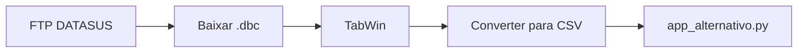

# 🏭 SINAN-CEMIG - Sistema de Visualizacao de Dados do SINAN

## 📋 Visao Geral

Aplicativo Streamlit para visualizacao de dados do Sistema de Informacao de Agravos de Notificacao (SINAN) relacionados a acidentes de trabalho no estado de Minas Gerais.

**Status:** ✅ Funcional com solucoes alternativas ao PySUS

---

## 🎯 Problema Resolvido

❌ **Problema Original:** O `pysus` requer compilacao C++ no Windows (via `pyreaddbc`), causando erros de instalacao.

✅ **Solucao:** Criadas multiplas alternativas que funcionam no Windows sem necessidade de compilacao.

---

## 📁 Estrutura do Projeto

```
SINAN-cemig/
├── app.py                      # App original (requer pysus)
├── app_alternativo.py          # ⭐ App SEM pysus (recomendado)
│
├── Documentacao/
│   ├── README_PROJETO.md       # Este arquivo
│   ├── GUIA_TABWIN.md          # Tutorial completo do TabWin
│   ├── alternativas_pysus.md   # Comparacao de alternativas
│   ├── RESUMO_ALTERNATIVAS.md  # Resumo executivo
│   └── INSTALACAO_WINDOWS.md   # Guia de instalacao original
│
├── Scripts/
│   ├── download_sinan_docs.py  # Download documentacao SINAN
│   ├── download_sinan_ftp.py   # Download dados via FTP (em dev)
│   ├── download_tabwin.py      # Download do software TabWin
│   ├── explorar_ftp_datasus.py # Explorador de FTP
│   └── sinan_docs_info.py      # Info sobre documentacao
│
├── Dados/
│   ├── sinan_docs/             # 📚 62 MB de documentacao oficial
│   │   └── Docs_TAB_SINAN/
│   │       ├── ACGRN_DIC_DADOS.pdf
│   │       ├── ACGRN_FICHA.pdf
│   │       ├── ACBION_DIC_DADOS.pdf
│   │       └── ... (160 arquivos)
│   │
│   └── tabwin/                 # 🛠️ TabWin 4.15 (14.94 MB)
│       ├── TabWin415.exe
│       ├── dbf2dbc.exe
│       └── ... (mapas e recursos)
│
└── data/                       # Pasta para arquivos CSV
```

---

## 🚀 Como Usar (Inicio Rapido)

### Opcao 1: App Alternativo (Recomendado) ⭐

```bash
# 1. Executar o app
streamlit run app_alternativo.py

# 2. No navegador que abrir:
#    - Selecione "Upload de arquivo CSV"
#    - Faca upload de um CSV do SINAN
#    - Explore os dados nas abas disponiveis
```

**Onde obter o CSV:**
1. [TabNet DATASUS](http://tabnet.datasus.gov.br/cgi/deftohtm.exe?sinannet/cnv/acgrMG.def) (mais facil)
2. Baixar .dbc do FTP + converter com TabWin (ver `GUIA_TABWIN.md`)

### Opcao 2: App Original (Requer Build Tools)

```bash
# 1. Instalar Microsoft C++ Build Tools (30-40 min)
# 2. Instalar dependencias
pip install -r requirements.txt

# 3. Executar
streamlit run app.py
```

---

## 📖 Guias Disponiveis

### Para Usuarios Iniciantes:

1. **[GUIA_TABWIN.md](GUIA_TABWIN.md)** 📘
   - Tutorial completo passo a passo
   - Como baixar dados do SINAN
   - Como usar o TabWin para converter DBC → CSV
   - Como visualizar no app

### Para Usuarios Intermediarios:

2. **[RESUMO_ALTERNATIVAS.md](RESUMO_ALTERNATIVAS.md)** 📊
   - Comparacao de metodos
   - Tabela de dificuldades
   - Links uteis

3. **[alternativas_pysus.md](alternativas_pysus.md)** 🔧
   - Detalhes tecnicos de cada alternativa
   - Codigo de exemplo
   - Pros e contras

### Para Desenvolvedores:

4. **[INSTALACAO_WINDOWS.md](INSTALACAO_WINDOWS.md)** 💻
   - Instalacao completa do pysus no Windows
   - Solucao de problemas
   - Build Tools

---

## 🛠️ Ferramentas Incluidas

### 1. TabWin 4.15 ✅ Baixado

**Local:** `tabwin/TabWin415.exe`

**Para que serve:**
- Converter arquivos .dbc (formato DATASUS) para CSV
- Criar tabulacoes personalizadas
- Visualizar mapas geograficos

**Como usar:**
```bash
# Executar
cd tabwin
TabWin415.exe
```

Ver guia completo: [GUIA_TABWIN.md](GUIA_TABWIN.md)

### 2. Documentacao SINAN ✅ Baixada

**Local:** `sinan_docs/Docs_TAB_SINAN/`

**Conteudo:**
- Dicionarios de dados (160 arquivos)
- Fichas de notificacao
- Manuais e instrucionais
- Legislacao (portarias, decretos)

**Principais documentos:**

| Arquivo | Descricao |
|---------|-----------|
| `ACGRN_DIC_DADOS.pdf` | Dicionario: Acidentes de Trabalho Graves |
| `ACBION_DIC_DADOS.pdf` | Dicionario: Acidentes Biologicos |
| `Manual_SinanNet.pdf` | Manual completo do sistema |

### 3. Scripts Python

#### `download_sinan_docs.py` ✅
Baixa documentacao oficial do SINAN do FTP

```bash
python download_sinan_docs.py
```

#### `download_tabwin.py` ✅
Baixa o software TabWin

```bash
python download_tabwin.py
```

#### `sinan_docs_info.py` ✅
Modulo Python com informacoes sobre agravos e documentacao

```python
from sinan_docs_info import get_info_acidente, listar_documentos

# Obter info sobre Acidentes Graves
info = get_info_acidente("ACGRN")
print(info['nome'])
print(info['variaveis_principais'])

# Listar todos os documentos
docs = listar_documentos()
```

---

## 📊 Comparacao de Metodos

| Metodo | Dificuldade | Windows | Automatico | Tempo Setup | Status |
|--------|-------------|---------|------------|-------------|--------|
| **app_alternativo.py** | ⭐ Facil | ✅ | ❌ Manual | 2 min | ✅ **Pronto** |
| TabNet + Upload | ⭐ Facil | ✅ | ❌ Manual | 5 min | ✅ Pronto |
| TabWin + Upload | ⭐⭐ Medio | ✅ | ⚠️ Semi | 10 min | ✅ Pronto |
| PySUS (app.py) | ⭐⭐⭐ Dificil | ⚠️ Problemas | ✅ Sim | 30-60 min | ⚠️ Requer Build Tools |
| FTP Direto | ⭐⭐ Medio | ✅ | ✅ Sim | 15 min | ⚠️ Em desenvolvimento |
| microdatasus (R) | ⭐⭐ Medio | ✅ | ✅ Sim | 10 min | ✅ Funcional |

**Recomendacao:** Use `app_alternativo.py` + TabNet para inicio imediato.

---

## 🔗 Links Importantes

### DATASUS:
- [Portal Principal](https://datasus.saude.gov.br/)
- [TabNet - Acidentes MG](http://tabnet.datasus.gov.br/cgi/deftohtm.exe?sinannet/cnv/acgrMG.def)
- [FTP DATASUS](ftp://ftp.datasus.gov.br/)
- [SINAN Portal](https://portalsinan.saude.gov.br/)

### Software:
- [Visual Studio Build Tools](https://visualstudio.microsoft.com/visual-cpp-build-tools/)
- [Python Downloads](https://www.python.org/downloads/)
- [Streamlit Docs](https://docs.streamlit.io/)

### Bibliotecas:
- [PySUS GitHub](https://github.com/AlertaDengue/PySUS)
- [PySUS Docs](https://pysus.readthedocs.io/)
- [microdatasus (R)](https://rfsaldanha.github.io/microdatasus/)
- [dbc_reader](https://github.com/lais-huol/dbc_reader)

### Tutoriais:
- [PySUS no Windows (Medium)](https://medium.com/@danielly.bx/tutorial-realizando-download-de-dados-p%C3%BAblicos-do-datasus-com-pysus-no-windows-fdbc317a0c5)
- [microdatasus Tutorial](https://medium.com/@danielly.bx/realizando-download-de-dados-p%C3%BAblicos-do-datasus-com-o-pacote-microdatasus-do-r-218cf4181e47)
- [Converter DBC (Medium)](https://medium.com/@felipezeiser/como-converter-os-dados-dbc-do-datasus-no-python-fb3b6a65918e)

---

## 🎓 Workflows Recomendados

### Para Analise Rapida (5 minutos):


1. Acesse TabNet
2. Configure parametros e exporte CSV
3. Execute `streamlit run app_alternativo.py`
4. Faca upload do CSV
5. Explore os dados

### Para Dados Completos (15 minutos):



1. Baixe arquivo .dbc do FTP
2. Abra no TabWin
3. Exporte como CSV
4. Carregue no app alternativo
5. Analise os dados

### Para Automacao (Desenvolvimento):


1. Desenvolver script de download automatico
2. Implementar conversao DBC → CSV
3. Pipeline de ETL
4. Armazenamento em BD
5. API REST + Dashboard

---

## 🐛 Solucao de Problemas

### App nao abre

```bash
# Verificar instalacao do Streamlit
pip install --upgrade streamlit

# Executar com Python diretamente
python -m streamlit run app_alternativo.py
```

### Erro ao carregar CSV

**Problema:** Encoding incorreto

**Solucao:** O app tenta automaticamente utf-8, latin-1 e cp1252

Se ainda assim falhar, converta manualmente:
```python
import pandas as pd
df = pd.read_csv('arquivo.csv', encoding='latin-1')
df.to_csv('arquivo_utf8.csv', encoding='utf-8-sig', index=False)
```

### TabWin nao abre arquivo .dbc

**Causas:**
- Arquivo corrompido
- Download incompleto
- Formato incorreto

**Solucoes:**
1. Baixe o arquivo novamente
2. Verifique o tamanho do arquivo
3. Teste com outro arquivo .dbc

---

## 📈 Proximos Passos Sugeridos

### Curto Prazo:
- [ ] Testar app_alternativo.py com dados reais
- [ ] Baixar dados de diferentes anos
- [ ] Explorar diferentes agravos (DENG, VIOL, etc)

### Medio Prazo:
- [ ] Implementar filtros geograficos (municipios MG)
- [ ] Adicionar graficos mais sofisticados
- [ ] Criar relatorios exportaveis (PDF)

### Longo Prazo:
- [ ] Automatizar download via FTP
- [ ] Implementar banco de dados
- [ ] Criar API REST
- [ ] Dashboard interativo com mapas

---

## 🤝 Contribuindo

### Reportar Problemas:
- Issues no GitHub do PySUS: https://github.com/AlertaDengue/PySUS/issues
- Email DATASUS: datasus@saude.gov.br

### Melhorias:
- Documentar novos workflows
- Criar scripts de automacao
- Compartilhar analises

---

## 📄 Licenca

**Dados:** Dominio publico (DATASUS/Ministerio da Saude)

**Software:**
- TabWin: Ministerio da Saude (uso livre)
- PySUS: MIT License
- Streamlit: Apache License 2.0

**Este Projeto:** Uso educacional e pesquisa em saude publica

---

## 📞 Suporte e Contatos

**DATASUS:**
- Telefone: 136 (Disque Saude)
- Email: datasus@saude.gov.br
- Site: https://datasus.saude.gov.br/

**Documentacao Tecnica:**
- PySUS: https://pysus.readthedocs.io/
- Streamlit: https://docs.streamlit.io/

---

## 🎉 Status do Projeto

| Componente | Status | Observacoes |
|-----------|--------|-------------|
| App Alternativo | ✅ Completo | Pronto para uso |
| Documentacao | ✅ Completa | 6 guias criados |
| TabWin | ✅ Baixado | Funcional |
| Docs SINAN | ✅ Baixadas | 160 arquivos |
| Scripts Download | ⚠️ Parcial | FTP em desenvolvimento |
| Automacao | ❌ Pendente | Proxima fase |

---

**Ultima atualizacao:** 2026-02-09

**Desenvolvido para:** Analise de Acidentes de Trabalho em Minas Gerais

**Fonte de Dados:** SINAN/DATASUS/Ministerio da Saude
